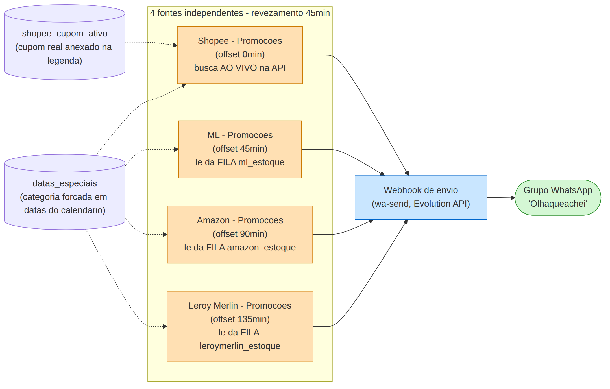
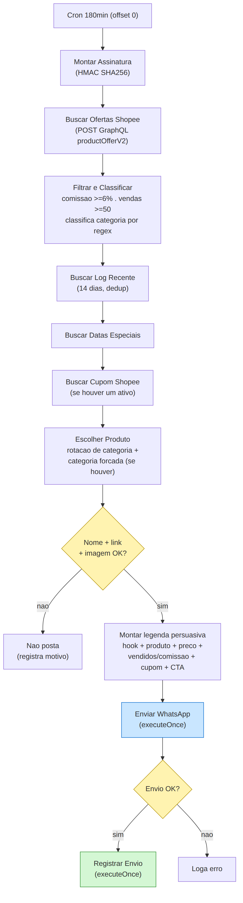
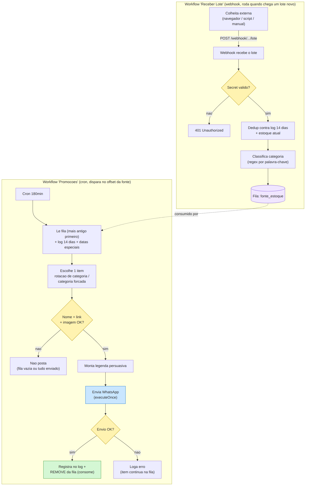
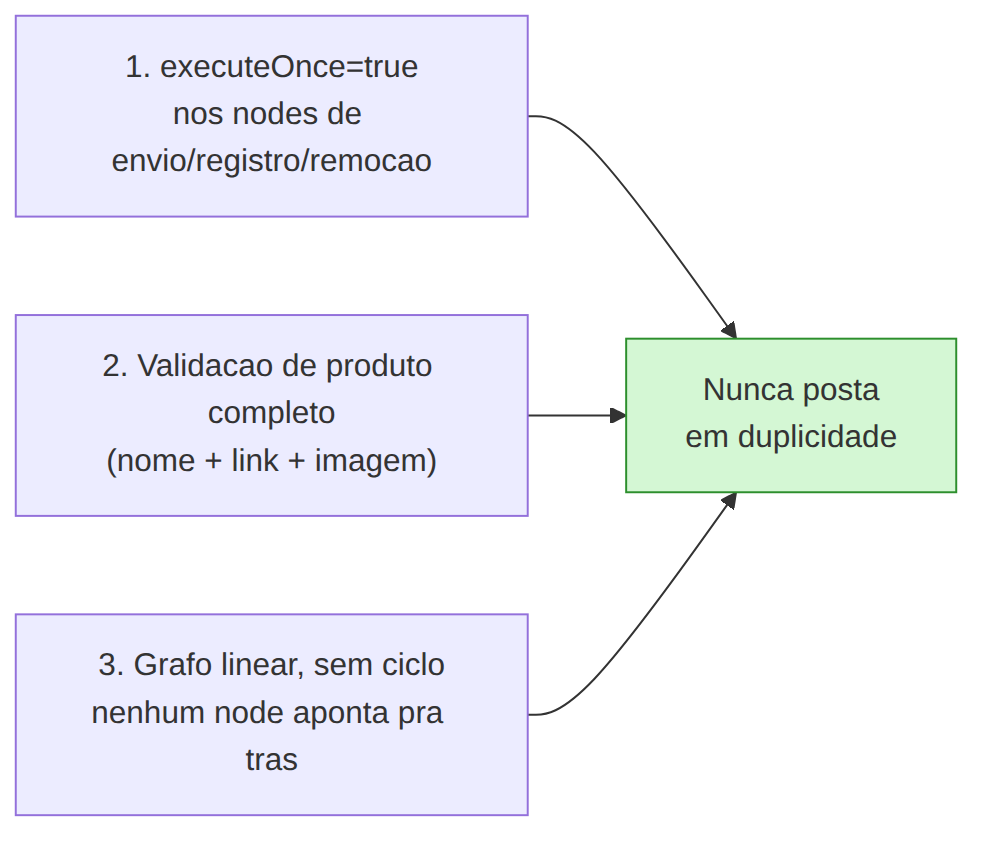
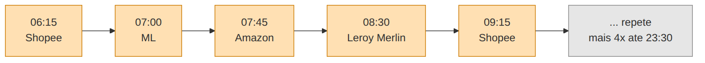

# Arquitetura visual

Este documento é o "desenho" completo da máquina: como as 4 fontes se revezam, como cada uma funciona por dentro, e como os dados fluem entre os workflows. Serve pra entender o sistema todo sem precisar ver uma linha de código.

Veja também o [README.md](README.md) (visão geral em texto).

## 1. Panorama geral — as 4 fontes revezando

Não existe orquestrador central. Cada fonte é independente, com seu próprio agendamento, e todas mandam para o mesmo webhook de envio do WhatsApp.

Resultado: 1 post no grupo a cada 45 minutos, revezando Shopee → ML → Amazon → Leroy Merlin → Shopee de novo, o dia inteiro (06:15 às 23:30).

## 2. Padrão A — Busca ao vivo (quando o marketplace tem API viável)

Quando existe uma API oficial de afiliados com comissão/vendas em tempo real, não precisa de fila: busca, filtra e escolhe tudo na mesma execução.

## 3. Padrão B — Fila abastecida em lote (quando não há API viável)

Sem API, um webhook separado recebe lotes colhidos externamente e guarda numa fila; o workflow de postagem consome dessa fila, mais antigo primeiro.

## 4. As 3 travas anti-spam (presentes em todo workflow de postagem)

## 5. Linha do tempo de um dia (revezamento das 4 fontes)

*(o ciclo se repete mais 4 vezes até 23:30 — 24 posts/dia no total, 6 por fonte)*

---

Os arquivos-fonte dos diagramas (editáveis, formato Mermaid) estão em [`diagrams/*.mmd`](diagrams) — dá pra abrir e editar em qualquer editor Mermaid (ex: [mermaid.live](https://mermaid.live)).
