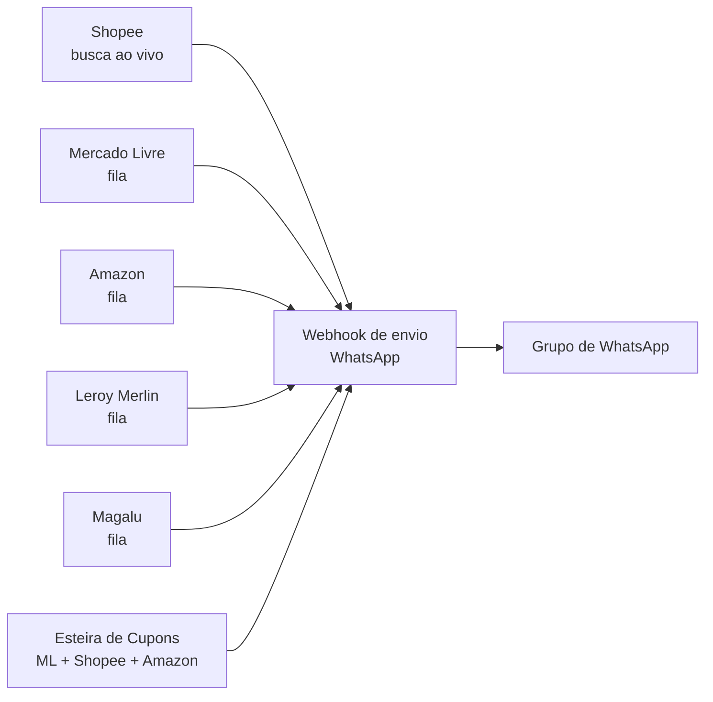
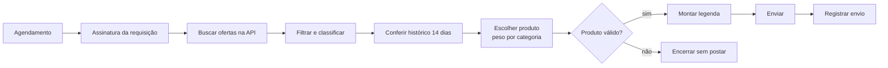
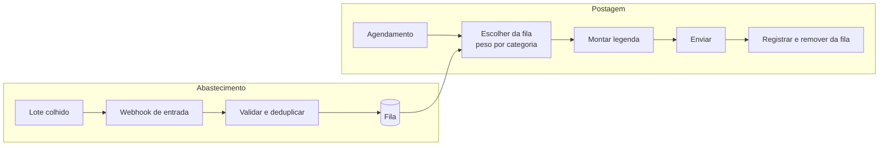
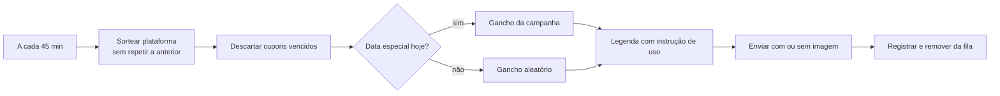
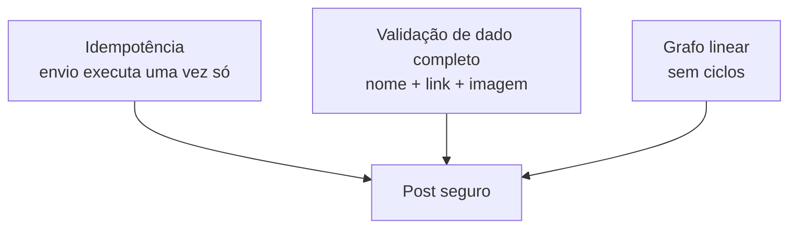
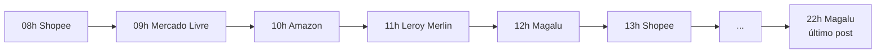

# Arquitetura visual

Este documento é o "desenho" completo da máquina: como as 5 fontes se revezam, como cada uma funciona por dentro, como funciona a esteira de cupons e como os dados fluem entre os workflows. Serve pra entender o sistema todo sem precisar ver uma linha de código.

Veja também o [README.md](README.md) (visão geral em texto).

## 1. Panorama geral — as 5 fontes revezando

Não existe orquestrador central. Cada fonte é independente, com seu próprio agendamento, e todas mandam para o mesmo webhook de envio do WhatsApp.

```mermaid
flowchart LR
SH[Shopee<br/>busca ao vivo] --> W[Webhook de envio<br/>WhatsApp]
ML[Mercado Livre<br/>fila] --> W
AM[Amazon<br/>fila] --> W
LM[Leroy Merlin<br/>fila] --> W
MG[Magalu<br/>fila] --> W
CP[Esteira de Cupons<br/>ML + Shopee + Amazon] --> W
W --> G[Grupo de WhatsApp]
```

Resultado: 1 post de produto por hora, revezando Shopee → Mercado Livre → Amazon → Leroy Merlin → Magalu, das 8h às 22h (15 posts por dia). A esteira de cupons roda em paralelo, com cadência própria.

## 2. Padrão A — Busca ao vivo (quando o marketplace tem API viável)

Quando existe uma API oficial de afiliados com comissão/vendas em tempo real, não precisa de fila: busca, filtra e escolhe tudo na mesma execução.

```mermaid
flowchart LR
A[Agendamento] --> B[Assinatura da requisição]
B --> C[Buscar ofertas na API]
C --> D[Filtrar e classificar]
D --> E[Conferir histórico 14 dias]
E --> F[Escolher produto<br/>peso por categoria]
F --> G{Produto válido?}
G -->|sim| H[Montar legenda]
H --> I[Enviar]
I --> J[Registrar envio]
G -->|não| X[Encerrar sem postar]
```

## 3. Padrão B — Fila abastecida em lote (quando não há API viável)

Sem API, um webhook separado recebe lotes colhidos externamente e guarda numa fila; o workflow de postagem consome dessa fila.

```mermaid
flowchart LR
subgraph Abastecimento
L[Lote colhido] --> R[Webhook de entrada]
R --> V[Validar e deduplicar]
V --> Q[(Fila)]
end
subgraph Postagem
S[Agendamento] --> P[Escolher da fila<br/>peso por categoria]
Q --> P
P --> M[Montar legenda]
M --> E[Enviar]
E --> T[Registrar e remover da fila]
end
```

## 4. Esteira de cupons

Um único workflow para três plataformas. Só entram cupons reais e verificados — nenhum código é inventado.

```mermaid
flowchart LR
A[A cada 45 min] --> B[Sortear plataforma<br/>sem repetir a anterior]
B --> C[Descartar cupons vencidos]
C --> D{Data especial hoje?}
D -->|sim| E[Gancho da campanha]
D -->|não| F[Gancho aleatório]
E --> G[Legenda com instrução de uso]
F --> G
G --> H[Enviar com ou sem imagem]
H --> I[Registrar e remover da fila]
```

## 5. As travas anti-spam (presentes em todo workflow de postagem)

```mermaid
flowchart TB
A[Idempotência<br/>envio executa uma vez só] --> D[Post seguro]
B[Validação de dado completo<br/>nome + link + imagem] --> D
C[Grafo linear<br/>sem ciclos] --> D
```

## 6. Linha do tempo de um dia

```mermaid
flowchart LR
H8[08h Shopee] --> H9[09h Mercado Livre] --> H10[10h Amazon] --> H11[11h Leroy Merlin] --> H12[12h Magalu]
H12 --> H13[13h Shopee] --> H14[...]
H14 --> H22[22h Magalu<br/>último post]
```

(o ciclo de 5 fontes se repete 3 vezes por dia — 15 posts no total, 3 por fonte)

Os diagramas usam Mermaid e são renderizados direto pelo GitHub.
